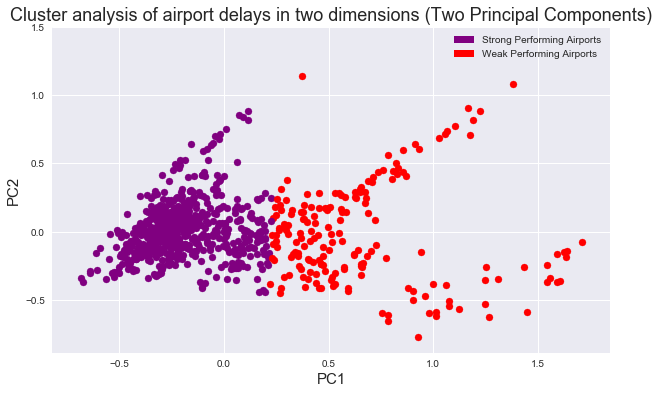

# Summary

For this project, I examined data on global airport delays over an 11 year period - from 2004 to 2014. The features of this dataset were metrics of an airport's on-time-performance for a given year - departure cancellations, arrival canccellations, departure diversions, arrival diversions, taxi delays, on time gate arrivals etc. I used unsupervised learning techniques, mainly K-means, to better understand where each airport fell within my feature space -- i.e. which airports were the best performing (clustered together with other airports that were regularly punctual) and which airports were the worst performing (clustered with airports that were habitually tardy). 

For the purpose of clustering and visualization, I used PCA to reduce the dimensionality of my feature space from 19 original features down to just 2 and then three principal components. This dataset is particularly amenable to PCA and I was able to describe just under 80% of the variance in the original feature space using just two components. 

I ultimately settled upon two clusters for my k-means. An analysis of the airports in both clusters was, perhaps, unsurprising. One cluster - the offending cluster - performs worse on every conceivable metric - higher departure cancellations, higher arrival cancellations, longer average taxi times, greater gate departure delays etc. The airports in this poorly performing cluster include JFK, LGA, EWR, LAX, ORD, DEN DFW and others. The other cluster, which always  

