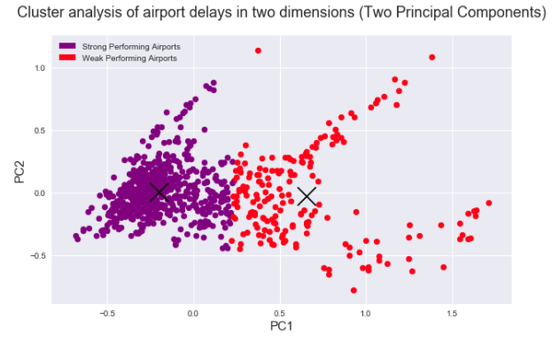

# Summary

## Project Overview and The Data

For this project, I examined data on global airport delays over an 11 year period - from 2004 to 2014. The features of this dataset were metrics of an airport's on-time-performance for a given year - departure cancellations, arrival canccellations, departure diversions, arrival diversions, taxi delays, on time gate arrivals etc. 

	

## Approach

I used unsupervised learning techniques, mainly K-means, to better understand where each airport fell within my feature space -- i.e. which airports were the best performing (clustered together with other airports that were regularly punctual) and which airports were the worst performing (clustered with airports that were habitually tardy). 

For the purpose of clustering and visualization, I used PCA to reduce the dimensionality of my feature space from 19 original features down to just 2 principal components. This dataset is particularly amenable to PCA and I was able to describe just under 80% of the variance in the original feature space using just two components.

Using K-means on two principal components, I was able to visualize my data. Here's what it looked like:

	

## Analysis

An analysis of the airports in both clusters was, perhaps, unsurprising. One cluster - the offending cluster (in red, above) - performs worse on every conceivable metric - higher departure cancellations, higher arrival cancellations, longer average taxi times, greater gate departure delays etc. How much worse did the airports in the poorly performing (red) cluster do than the strong performing (purple) cluster? Here's a snapshot:

	

Above, we can see that airports in the red cluster experience cancellations, diversions and delays that are multiples higher than the airports in the purple cluster. Additionally, we see that their percentage on time metrics are a fraction of the airports in the purple cluster. 

My next point of analysis was to see which were the absolute worst offenders. I had data on 74 unique airports over the course of 11 years (in general, though there were some exceptions). So, which airports were classified in the "bad" cluster for all 11 years in the data, without exception? Spoiler alert: as a New Yorker, the results are gut wrenching. Those airports are:

### Naughty List

**JFK** - John F. Kennedy International Airport (NYC)
**DFW** - Dallas Fort Worth International Airport
**EWR** - Newark Liberty International Airport
**IAH** - George Bush Intercontinental Airport (Houston)
**LGA** - Laguardia Airport (NYC)
**PHL** - Philadelphia International Airport
**LAX** - Los Angeles International Airport
**DEN** - Denver International Airport
**ORD** - O'Hare International Airport (Chicago)

Conversely, there were many airports that performed excellently according to my K means model in all 11 years of the data. That list of airports contained 45 distinct airports and included: 

### Nice List

**PDX** - Portland International Airport
**SEA** - Seattle Tacoma International Airport
**BDL** - Bradley International Airport (Connecticut)
**STL** - St. Louis Lambert International Airport
**BUR** - Hollywood Burbank Airport
**RSW** - Southwest Florida International Airport
**SLC** - Salt Lake International Airport
**SMF** - Sacramento County Airport
**TPA** - Tampa International Airport

## Discussion

So what's the upshot of all this? It turns out that all the airports on the naughty list are simply the busiest airports. In fact, seven out of nine airports on my naughty list are in the [top 50 busiest airports in the world](https://en.wikipedia.org/wiki/List_of_busiest_airports_by_passenger_traffic#2014_statistics). Simply put, *more traffic, more delays*. 
